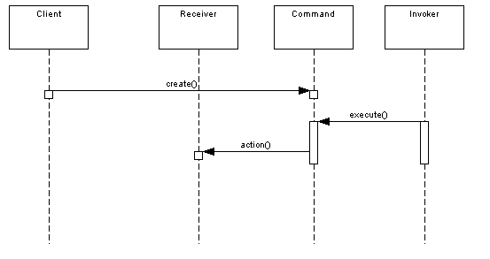

#### Padrão
Encapsulate a request as an object, thereby letting you parameterize clients with different requests, queue or log 
requests, and support undoable operations.

#### Diagrama sequência

#### When would you use this pattern
>. A history of requests is needed  
. You need callback functionality  
. Requests need to be handled at variant times or in variant orders  
. The invoker should be decoupled from the object handling the invocation.

#### Fonte
[DZone - James Sugrue](https://dzone.com/articles/design-patterns-command)