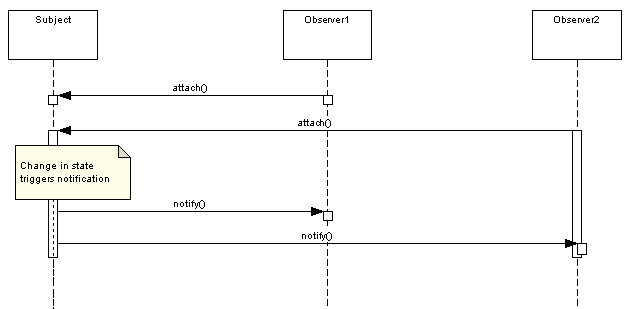

#### Padrão
Define a one-to-many dependency between objects so that when one object changes state, all its dependents are notified 
and updated automatically.

#### Diagrama sequência

#### The Observer In The  Real World
The event listener is the most popular, where you register an ActionListener to a UI control, such a button,
and react to action events using the actionPerformed method.  

In this case, the ActionListener is the Observer and the button is your Subject.  

As the button changes state, you can react, if you choose to, in your actionPerformed method. 

#### When would you use this pattern
In general, you want to use this pattern to reduce coupling.  

If you have an object that needs to share it's state with others, without knowing who those objects are, 
the Observer is exactly what you need.

#### Java
The slight difference from the classic definition is that Observable is used in place of the Subject and is implemented 
as a class, while the Observer interface remains the same.

#### Fonte
[DZone - James Sugrue](https://dzone.com/articles/design-patterns-uncovered)