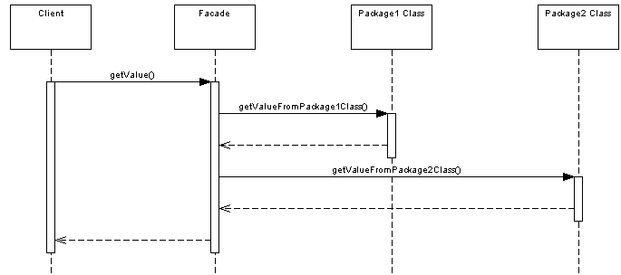

#### Padrão
Provide a unified interface to a set of interfaces in a subsystem. 
Façade defines a higher-level interface that makes the subsystem easier to use.

#### Diagrama sequência
Tudo que o cliente precisa é realizar o contato diretamente com o Facade, que se encarrega de esconder códigos legados 
ou bibliotecas de terceiros.  

#### When would you use this pattern
in web services, one web service might provide access to a number of smaller services that 
have been hidden from the caller by the facade. 

Assim sendo, o padrão de projeto Facade é frequentemente implementado para fornecer um acesso simples e unificado a 
sistemas legados, criar uma API pública para classes (como os drivers), combinar serviços e oferecer um acesso único 
de granulação grossa, reduzir as chamadas de rede, encapsular o fluxo e detalhes internos de uma aplicação para 
segurança e simplicidade.

#### Fonte
[DevMedia](https://www.devmedia.com.br/como-implementar-pattern-facade-na-nova-plataforma-java-ee/32469)